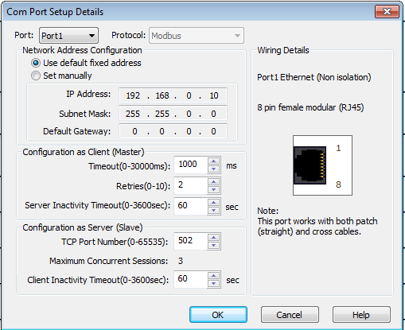
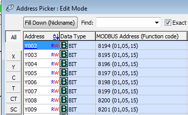

# Click as Modbus slave (server)

# PLC setup

Modbus TCP/IP works on port 1 of the PLC. The default settings can be used.

**important !**

There seems to be a bug in version 2.60 of the CLICK Programming Software.

The decimal modbus adresses differ by 1 in the decimal view.

Coil Y002 has modbus address 8194 in the DEC view (which is 20002 HEX).

Coil Y002 has modbus address 2001 in the HEX view (which is 1893 DEC). This seems to be the correct one.

## Node Red setup

## REST server setup
