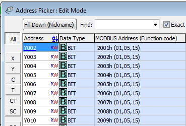

# Click as Modbus slave (server)

## Getting Started

### PLC setup

Modbus TCP/IP works on port 1 of the PLC. The default settings can be used. The PLC will be used as a Modbus slave device.

**important !**

~~There seems to be a bug in version 2.60 of the CLICK Programming Software.~~

~~The decimal modbus adresses differ by 1 in the decimal view.~~

~~Coil Y002 has modbus address 8194 in the DEC view (which is 20002 HEX).~~

~~Coil Y002 has modbus address 2001 in the HEX view (which is 1893 DEC). This seems to be the correct one.~~

**Example:**

Lets say you want to read holding register 40005

This has function code 03 and the PDU address must be 0004

### Node Red setup

Node Red has a [Modbus Package](https://www.npmjs.com/package/node-red-contrib-modbus) where you can use Node Red as the Modbus Master (client).

**Reading a value:**

General flow:

Configuring the register to read out:

Modbus server (slave) configuration:

**Writing a value:**

General flow:

Write config:

