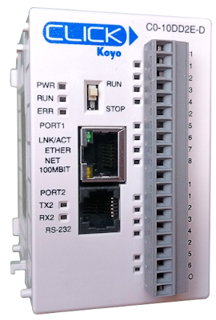
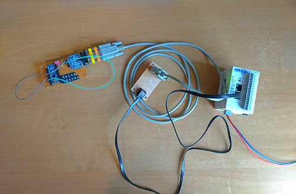
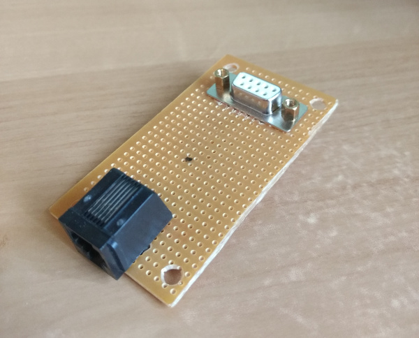
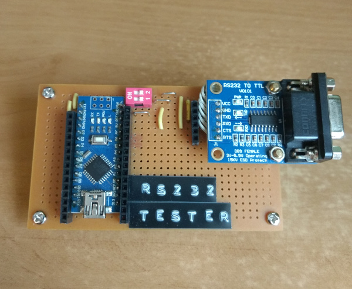

# Click RS232

## Introduction

The [Koyo Click C0-10DD2E-D](https://www.automationdirect.com/adc/shopping/catalog/programmable_controllers/click_series_plcs_(stackable_micro_brick)/plc_units/c0-10dd2e-d) PLC has one serial RS232 communication port. 

This document describes the setup needed to send serial data to other devices(Arduino, PC, ...) and will be the basis for further developments.

## Hardware

Used hardware:

- Click PLC
- RJ12 cable
- RJ12 to DB9 Adapter
- DB9 Cable
- DB9 adapter
- RS232 Test Board
    - RS232 to TTL converter
    - Arduino Nano

### Click Serial Port

The PLC uses a RJ12 connector for the RS232 port. Because RS232 usually uses a DB9 cable, I've made a adapter board to go from RJ12 to DB9.

The pinout for eacht PLC can be found on the product website. The C0-10DD2E-D CPU has following pinout:

|Pin|Name|Description|
|---|---|----|
|1|0V|GND|
|2|5V|5V|
|3|RXD|Data receive|
|4|TXD|Data transmit|
|5|RTS|Request to send|
|6|5V|GND|

### RS232 Test board

The output of the PLC is connected to a test board. This board consists of:

* RS232 to TTL converter
* Arduino Nano

